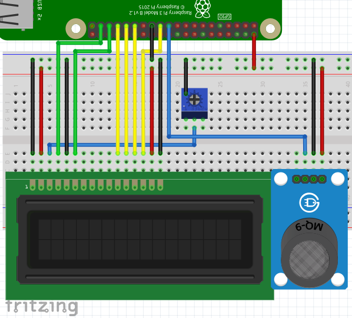
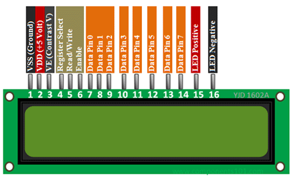

<!-- To convert this file to HTML, use `pandoc -t html -o index.html index.md`. -->

<link rel="stylesheet" type="text/css" href="splendor.css">

# Electronics Pratice Essay

## Introduction

### Motivation

Once upon a time, I was outside my dad's office, and I smell something wrong: a
hard-to-breathe gas smell. I immediately rushed to a worker nearby, and found
out the cause is a leaking gas tube.


Therefore, combining my interest in computers in general and the incident, I
decided to design my very own gas detector that comes with some sort of IoT
functionality.

### Target

Make a IoT-enabled, easy to DIY, modular and commercially viable product that
detects flammable gas and carbon monoxide, and warns the owner under abnormal
circumstances.

## Project Preparation

### Materials

* Functional parts
    * Raspberry Pi 4B, 4GiB RAM
    * MQ-9 Flammable Gas and CO Sensor Module.
    * 16x2 Text LCD Module.
* Packaging
    * Hard paper (2mm)
    * Styrofoam glue
    * Marker (Optoinal)

### Prerequsite skills

You will need to know:

* Basic Python
* Basic Linux coreutils' usage

### Wiring

* Breadboard Wiring:

    

* 16x2 LCD Pinout

    

* Raspberry Pi 4 GPIO Pinout:

    

## Software

### System

I am a advenced Linux user myself, so I chose to install Arch Linux ARM on the
Pi. Here is how I installed it:

1. Download a
   [modified version](https://olegtown.pw/Public/ArchLinuxArm/RPi4/rootfs/)
   of Arch Linux ARM image that is built for `aarch64` (64-bit ARM)
   architecture.

2. Extract the tarball.

    ```
    # dd if=ArchLinuxARM-rpi-4-aarch64-2020-05-06.tar.gz of=/dev/sdX status=progess
    ```

3. Unmount the SD card and insert it to the Pi.

4. Login as `root`, whose password is also `root`.

5. Add a user repository for Pi's aarch64 kernals.

    ```
    /etc/pacman.conf

    [raspi_aarch64]
    SigLevel = Optional TrustAll
    Server = http://107.145.175.222:8000/my_repo/aarch64
    ```

6. Do a full system upgrade, and install some programming tools

    ```
    # pacman -Syyuu neovim ranger python-pip networkmanager cronie
    ```

7. Configure NetworkManager

    ```
    # systemctl enable --now NetworkManager.service
    # nmtui
    ```

8. Install Python modules

    ```
    # pip install -U pip RPi.GPIO RPLCD fbchat
    ```

9. Enable auto login

    ```
    # systemctl edit getty@tty1
    [Service]
    ExecStart=
    ExecStart=-/usr/bin/agetty --autologin username --noclear %I $TERM
    ```

10. Running A Python Script At Boot Using Cron

    ```
    # systemctl enable --now cronie.service
    # sudo crontab -e

    @reboot python /home/root/main.py &
    ```

11. Create a dummy Facebook and Google account and set them up.

### Code

```python
# ~/main.py

import RPi.GPIO as GPIO
from RPLCD import CharLCD
import time
import socket
import threading
from fbchat import Client
from fbchat.models import *
import sys

debug = False
recieveID = '100026934047664'  # Chengxuan He
loginEmail = 'yorkpasquale@gmail.com'  # york.pasquale
loginPwd = 'KGLuU4Eg'


# https://stackoverflow.com/questions/166506/finding-local-ip-addresses-using-pythons-stdlib
def ip_addr(): return [l for l in ([ip for ip in socket.gethostbyname_ex(socket.gethostname())[2] if not ip.startswith("127.")][:1], [
    [(s.connect(('8.8.8.8', 53)), s.getsockname()[0], s.close()) for s in [socket.socket(socket.AF_INET, socket.SOCK_DGRAM)]][0][1]]) if l][0][0]


def onMQ9FallingEdge(channel):
    emergencyMessage = '🔥🔥🔥 WARNING: FLAMMABLE GAS CONCENTRATION TOO HIGH! 🔥🔥🔥'
    client.send(Message(text=emergencyMessage), thread_id=client.uid)
    client.send(Message(text=emergencyMessage), thread_id=recieveID)


class EchoBot(Client):
    def onMessage(self, author_id, message_object, thread_id, thread_type, **kwargs):
        self.markAsDelivered(thread_id, message_object.uid)
        self.markAsRead(thread_id)

        print("{} from {} in {}".format(
            message_object, thread_id, thread_type.name))

        # If you're not the author, echo
        if author_id != self.uid:
            self.send(Message(text='Time: {}\nMode: {}\nLocal IP address: {}\nMQ-9 Status: {}\nFacebok Messenger: {}'
                              .format(time.strftime('%Y-%m-%d %H:%M:%S', time.localtime()),
                                      'Debug' if debug else 'Normal',
                                      ip_addr(),
                                      'Safe' if GPIO.input(11) else 'Warn',
                                      'Connected' if chat_thread.is_alive() else 'Error')),
                      thread_id=thread_id,
                      thread_type=thread_type)


try:
    client = EchoBot(loginEmail, loginPwd)
except:
    isLoggedIn = False
chat_thread = threading.Thread(target=client.listen)
chat_thread.start()

GPIO.setwarnings(False)
lcd = CharLCD(numbering_mode=GPIO.BOARD, cols=16, rows=2,
              pin_rs=37, pin_e=35, pins_data=[33, 31, 29, 23])
GPIO.setup(11, GPIO.IN)  # MQ-9 Dout
GPIO.add_event_detect(
    11, GPIO.FALLING, callback=onMQ9FallingEdge, bouncetime=2000)

try:
    blinkState = True
    running = True
    while running:
        try:
            lcd.write_string(('R' if blinkState else ' ') + ' ' + ip_addr())
        except OSError:
            lcd.clear()
            lcd.write_string(('E' if blinkState else ' ') + '  No IP Address')
        lcd.crlf()
        lcd.write_string('MQ-9:' + ('Safe' if GPIO.input(11) else 'Warn'))
        lcd.write_string(' FB:' + ('OK' if chat_thread.is_alive() else 'NO'))
        blinkState = not blinkState
        time.sleep(1)
        lcd.clear()
except (KeyboardInterrupt, EOFError):
    running = False
finally:
    lcd.clear()
    lcd.write_string('E ' + ip_addr() + '\n\rPy Not Running')
    GPIO.cleanup()
```

## Refences

[LCD Tutorial](https://www.circuitbasics.com/raspberry-pi-lcd-set-up-and-programming-in-python/)
